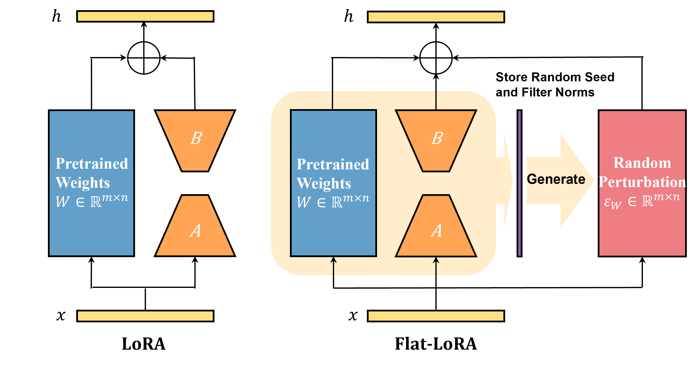

# [Flat-LoRA: Low-Rank Adaptation over a Flat Loss Landscape](https://arxiv.org/abs/2409.14396)

Official implementation of our ICML 2025 paper "[Flat-LoRA: Low-Rank Adaptation over a Flat Loss Landscape](https://arxiv.org/abs/2409.14396)".


## Overview

We introduce Flat-LoRA, which aims to identify a low-rank adaptation situated in a flat region of the full parameter space. Instead of adopting the well-established sharpness-aware minimization approach, which incurs significant computation and memory overheads, we employ a Bayesian expectation loss objective to preserve training efficiency. Further, we design a refined random perturbation generation strategy for improved performance and carefully manage memory overhead using random seeds. Experiments across diverse tasks—including mathematical reasoning, coding abilities, dialogue generation, instruction following, and text-to-image generation—demonstrate that Flat-LoRA improves both in-domain and out-of-domain generalization.

<div align="center">

<div align="left">

## Quick Start

Our code is based on the official implementation of [LoRA-GA](https://github.com/Outsider565/LoRA-GA). To use Flat-LoRA, you should run the vanilla LoRA command and add the configuration `rho`.  

#### Run vanilla LoRA 

```bash
python run_exp.py ++dataset_name=meta_math +peft=all model=llama ++seed=42 +peft.lora_r=8  wandb.project=${your_project} wandb.name=vanilla_lora
```

#### Run Flat-LoRA 

```bash
python run_exp.py ++dataset_name=meta_math +peft=all model=llama ++seed=42 +peft.lora_r=8  wandb.project=${your_project} wandb.name=flat_lora ++rho=0.05
```


To accelerate the evaluation on GSM8K with greedy decoding, you can run `eval_gsm8k_batch.py` using the following command:

```bash
python eval_gsm8k_batch.py results/${your_project}_meta_math/${wandb.name}/42/checkpoint-6250/
```


## Acknowledgement

We sincerely thank the official code implementation of  [LoRA-GA](https://github.com/Outsider565/LoRA-GA). 

## Citation 

```
@inproceedings{li2024flat,
  author       = {Tao Li and Zhengbao He and Yujun Li and Yasheng Wang and Lifeng Shang and Xiaolin Huang},
  title        = {Flat-LoRA: Low-Rank Adaptation over a Flat Loss Landscape},
  booktitle    = {International Conference on Machine Learning (ICML)},
  year         = {2025},
  organization = {PMLR}
}
```

